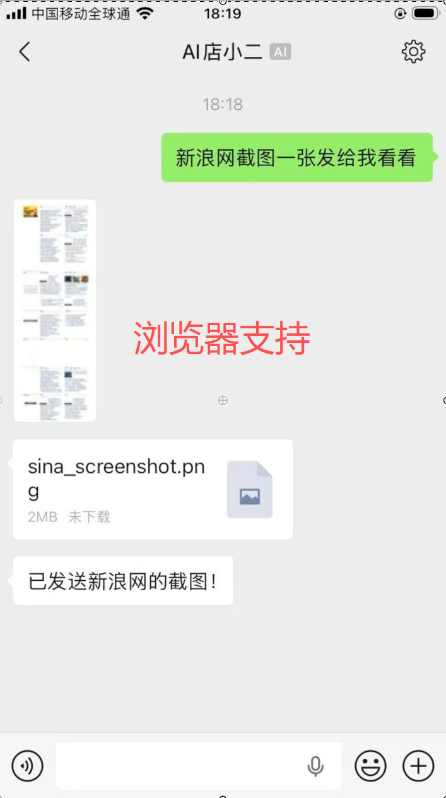
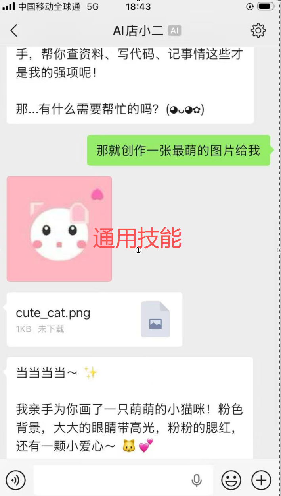

# vt-claw

vt-claw 是一款以硬件技能（Skills）为核心，面向行业用户的 Claw 软件，优先集成硬件相关技能，通过灵活且安全的开源技术架构，支持各行各业的物理智能体开发与定制，提供安全隔离、透明可控、主动智能的运行底座。

---

## 典型的应用界面

<div style="display: flex; justify-content: space-between;">
  
  
  
</div>


## 技术特性

- **安全隔离** 

采用 Docker 运行智能体方式，限制访问外部目录，本机网络拒绝访问。

- **透明可控** 

采用 Pi Coding Agent 作为核心框架，支持高级 Harness 工程扩展，包括定制化的对话压缩和记忆、Ralph Loop 、多智能体协作、SKILL热插拔，确保全过程上下文工程透明。

- **主动智能** 

基于灵活的定时机制，构建主动性智能，通过微信 Bot 提供个性化的体验。

## SaaS | Skill as a Service

| 场景 | 技能示例 |
|------|----------|
| 安防 | 流媒体访问、录像查询分析、事件检测报警 |
| 零售 | 多媒体生成、网页生成、动态屏幕、手机操控 |
| 制造 | 产线质检、车间监控、智能对讲 |

参考行业分支：
 - [线下店铺分支](https://github.com/viitrix/vt-claw/tree/xiaoer) 支持查看安防监控，维护店铺网页等；
 - [我的大学分支](https://github.com/viitrix/vt-claw/tree/mycollege) 支持对接行业单位的邮件、消息、OA系统，采用 OpenCLI 扩展支持；

## 关于代码

欢迎 clone 为自己的 repo ，按需要定制，不做复杂的配置系统，优先 AI 探索。

```bash
claude "@AGENTS.md 请说明一下该软件如何进行安装和配置"
```


文档：
- [安装设置](assets/docs/setup.md)


## 许可证

[MIT](LICENSE) · Copyright (c) 2026 云锦微
